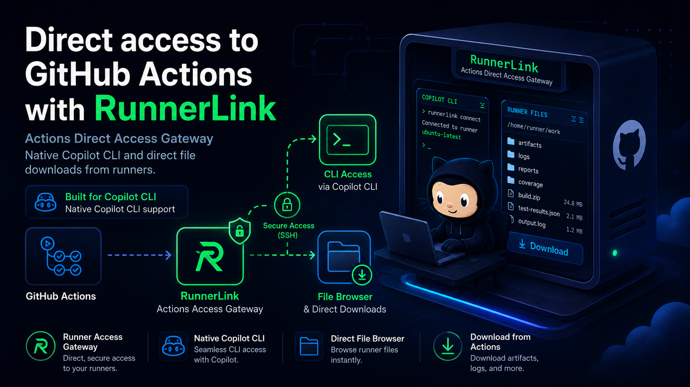

<table>
<tr>
<td width="55%">

</td>
<td>

## RunnerLink

**Your only Actions gateway.**

RunnerLink gives you direct SSH access to GitHub-hosted runners through a reverse-tunnel gateway — from a single desktop app. Launch runners, dock interactive terminals, browse remote files, and manage tool authentication, all without leaving your local machine.

</td>
</tr>
</table>

---

## Quick Start

```bash
# 1. Generate SSH keys and build the gateway
bash test-assets/generate-keys.sh
docker compose up --build -d

# 2. Launch RunnerLink
./runnerlink
```

> **Requirements:** Python 3.10+, Tk, Docker, and the [GitHub CLI](https://cli.github.com/) (`gh`).

---

## How It Works

```
┌──────────────┐       reverse tunnel        ┌───────────────────┐
│  RunnerLink  │ ──ssh→ gateway:50556 ←────── │  GitHub Runner    │
│  (your PC)   │ ──ssh→ gateway:2222  ─────→  │  (Actions VM)     │
└──────────────┘                              └───────────────────┘
```

1. **Gateway** — A lightweight Docker container runs OpenSSH with `GatewayPorts yes`, accepting reverse tunnels on ports 2222–2231.
2. **GitHub Workflow** — A dispatched Actions job installs SSH on the runner, injects your public key, and opens a persistent reverse tunnel back to the gateway.
3. **RunnerLink** — Connects through the tunnel, giving you a full interactive shell, file browser, and tool management on the live runner.

---

## Setup

### 1 — Start the Gateway

```bash
bash test-assets/generate-keys.sh   # generate keys + authorized_keys
docker compose up --build -d         # build & start the gateway
docker compose logs -f gateway       # verify it's listening
```

### 2 — Port Forwarding

Forward these ports on your router to the machine running the gateway:

| Port(s) | Purpose |
|---------|---------|
| **50556** | Gateway SSH — runners connect here |
| **2222–2231** | Tunnel endpoints — you connect here |

### 3 — GitHub Secrets

Go to **Settings → Secrets → Actions** in your repository:

| Secret | Value |
|--------|-------|
| `GATEWAY_PRIVATE_KEY` | Contents of `test-assets/id_rsa_test` (full file) |
| `GATEWAY_HOST` | Your public IP (`curl -s icanhazip.com`) |
| `GATEWAY_PORT` | `50556` |
| `GATEWAY_USER` | `gateway` |

### 4 — Launch RunnerLink

```bash
./runnerlink
```

Click **Probe** on the default runner to start a workflow, or use **Add Runner** to create additional named workstreams on separate tunnel ports.

### 5 — Connect Manually (optional)

You don't need the app — any SSH client works:

```bash
ssh -i test-assets/id_rsa_test -p 2222 -o StrictHostKeyChecking=no runner@<YOUR_PUBLIC_IP>
```

---

## Features

| Feature | Description |
|---------|-------------|
| **Docked Terminal** | Embed a full xterm session inside the app — one per runner, preserved across tab switches |
| **Multiple Runners** | Run up to 10 concurrent workstreams on ports 2222–2231 |
| **File Explorer** | Browse, navigate, and download files from the remote runner |
| **Tool Auth** | One-click setup and authentication for GitHub CLI, Copilot, Azure CLI, and Azure Data Explorer |
| **Countdown Timer** | Per-runner lifetime countdown with amber (< 1 hr) and red (< 15 min) warnings |
| **Session Management** | Auto-link workflow runs, probe tunnels, and cancel stale sessions |
| **Copy / Paste** | Toolbar buttons, right-click paste, Ctrl+Shift+C/V, and middle-click in the docked terminal |

---

## Project Structure

```
.
├── runnerlink                      # Launch script
├── helper-widget/
│   ├── runner_widget.py            # RunnerLink application
│   ├── config.example.json         # Default configuration (tracked)
│   └── config.json                 # Local overrides (gitignored)
├── .github/workflows/
│   └── runnerLink.yml              # GitHub Actions reverse-tunnel workflow
├── Dockerfile                      # SSH gateway (Ubuntu 22.04 + OpenSSH)
├── docker-compose.yml              # Gateway service definition
└── test-assets/
    └── generate-keys.sh            # SSH key + authorized_keys generator
```

---

## Configuration

Copy and edit the example config for local customization:

```bash
cp helper-widget/config.example.json helper-widget/config.json
```

**Workstreams** — Each runner has a name, branch, tunnel port, and max lifetime (default 6 hours). Add runners from the app UI or edit the JSON directly.

**Tools** — Modular check / install / auth commands for GitHub CLI, Copilot, Azure CLI, and Azure Data Explorer. The app runs these on the runner over SSH.

> Never store tokens or passwords in config files. All authentication flows happen interactively in a trusted terminal session.

---

## Troubleshooting

| Symptom | Check |
|---------|-------|
| Gateway SSH refused on 50556 | `docker compose ps` — is the container running? |
| Runner can't reach gateway | Verify router port forwarding and public IP |
| Tunnel port (2222) refuses | Is the workflow still running? Check `gh run list` |
| Permission denied | Confirm you're using the matching private key |
| `az login` crashes | RunnerLink auto-patches the profile for free/no-subscription accounts |
| Terminal clips after resize | Click **Redock** or switch tabs and back |

Check gateway logs anytime:

```bash
docker compose logs -f gateway
```

---

## License

MIT

---

<p align="center">
  <strong>RunnerLink</strong> — Your only Actions gateway.
</p>
